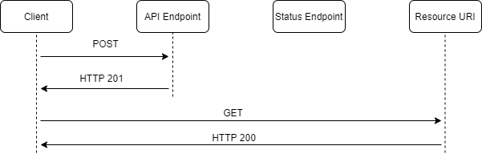
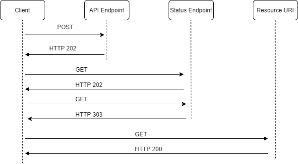

# AllTheClouds Subscription Based Products (Early Adopters)
**Clouds as a Service (CaaS)**

AllTheClouds is shaking up the Cloud retail market by offering Clouds as a Service (CaaS) this means people no longer need to wait for a physical cloud to be delivered to receive their atmospheric benefits.

AllTheClouds are inviting key partners to develop integrations to sell the new CaaS offering prior to it becoming available to the wider market.

## What is AllTheClouds CaaS?
The as a service offering allows partners to purchase time on a shared cloud on behalf of their customers. As the customer will not own the physical cloud they can turn on and off access to the cloud when they need to and are only charged for the time they consume.

### How will it work?
-	Customers will order a subscription for a cloud type and quantity (scale). 
-	The subscription will enable them to access their virtual clouds at any time. 
-	Customers will be able to start and stop their clouds as their need for them changes, we hope to introduce automated cloud scheduling soon.
-	Customers can also change the quantity of clouds available for their subscription by changing the quantity. 
-	If a customer no longer needs a cloud, they can cancel the subscription.
-	Ordering and modification on the cloud subscriptions is handled by our CaaS REST API only, there is no user interface to manage these subscriptions.

## AllTheClouds CaaS REST API
### Authentication
Using the API key added to an appropriate header as the existing ordering API endpoint requires.

### Create and update operations
All POST and PATCH operations on the CaaS API will have the ability to return immediately or return an Operation Reference Number (OpRef) for long running asynchronous operations. This **OpRef** is used to track the status of long running operations via the Status endpoint. This endpoint will return the current status of a given operation.

The following diagrams below illustrates how the POST (Create) operations will work in both scenarios. The scenarios for PATCH will be the same apart from the HTTP Status code for immediate update will be 200 not 201.

**_FIG. 1 – No async immediate creation_**

**_FIG. 2 – Async long running task_**

## Additional Information

-	The HTTP 202 response will indicate the location and frequency that the client should poll for the response. It has the following additional headers:

|Header	|Description	|Notes|
|-|-|-|
|Location|	A URL the client should poll for a response status.|This is the URL of the status endpoint including the OpRef code.|
|Retry-After|	An estimate of when processing will complete|	This header is designed to prevent polling clients from overwhelming the back-end with retries.|

-	Upon successful processing, the resource specified by the Location header will return an appropriate HTTP response code such as 200 (OK), 201 (Created), or 204 (No Content).
-	If an error occurs during processing, the error will be persisted at the resource URL described in the Location header and will return an appropriate response code to the client from that resource (4xx code).
